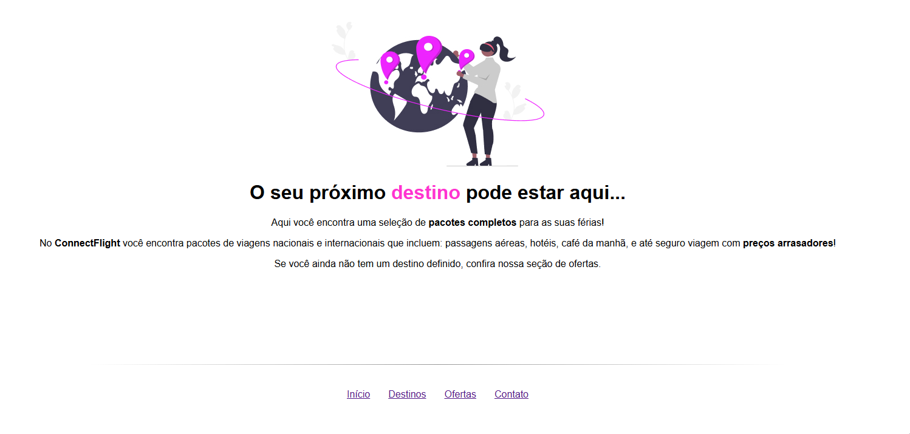

Amanda Loyse - Arapoema

Objetivo da Atividade
O objetivo desta atividade é reproduzir, utilizando React, o layout apresentado no protótipo
do Figma, aplicando os conceitos fundamentais de componentização, estilização e
organização de código.
A proposta visa desenvolver sua compreensão sobre como o React estrutura uma aplicação
moderna, estimulando boas práticas de divisão em componentes reutilizáveis, uso de CSS
ou Styled Components e manutenção de um código limpo e organizado.
No protótipo disponibilizado, o rodapé apresenta três links de navegação, mas as telas
correspondentes não foram criadas no modelo. Assim, cabe a você definir e desenvolver
essas telas adicionais, conforme achar mais adequado — por exemplo, páginas de Sobre,
Contato ou Serviços. Atenção, tente explorar ao máximo a componentização. A criação das
telas componentizadas fazem parte da avaliação.
Após criá-las, implemente a navegação entre as páginas, garantindo que cada link do
rodapé direcione corretamente para a respectiva tela criada.
Habilidades Técnicas Esperadas
HTML e JSX:
● Utilizar HTML e JSX para estruturar o conteúdo da página.
● Compreender a sintaxe JSX e sua relação com o JavaScript.
CSS:
● Aplicar estilos com CSS ou Styled Components para tornar a interface atraente.
● Usar Flexbox e/ou Grid para criar layouts responsivos e alinhados ao design do
Figma.
React Basics:
● Criar e organizar componentes funcionais.
● Utilizar props e state de forma simples, se necessário.
● Manter uma boa estrutura de pastas e arquivos do projeto.
Habilidades Comportamentais Desenvolvidas
Resolução de Problemas:
● Identificar e resolver desafios relacionados à renderização, estilização ou
organização do código.
Atenção aos Detalhes:
● Reproduzir fielmente o design, garantindo harmonia visual e responsividade.
Organização:
● Estruturar o código de forma limpa e bem comentada, facilitando futuras
manutenções.

